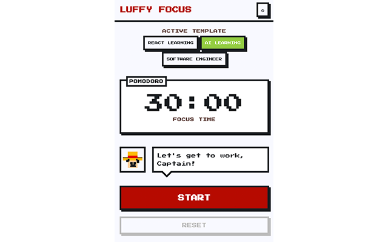
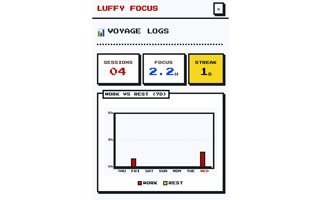

# Luffy Focus ⛵

A One Piece–themed Pomodoro timer Chrome extension with pixel-art aesthetics. Built with Manifest V3, vanilla JavaScript, and a shared timer engine that runs reliably across popup and service worker.




---

## Features

**Pomodoro timer with auto-rest.** Start, pause, resume, and reset the clock. When a work session finishes, rest starts automatically. The timer keeps running even when the popup is closed — the service worker owns the countdown and persists state.

**Work templates.** Create multiple templates (e.g. "Coding Sprint", "Deep Reading") with custom work/rest durations, active weekdays, and a color. Switch between them in one click. The timer picks up the active template's duration on reset.

**Session summaries.** After every completed work session, an overlay prompts you to jot down what you accomplished. Save it to the log or discard.

**Voyage Logs dashboard.** The stats screen shows:
- sessions completed today
- total focus time in hours
- current daily streak
- 7-day Work vs. Rest bar chart (click a day to drill into that day's log)
- detailed session log with template, time range, and memos

**Pixel Luffy mascot.** A canvas-drawn Luffy sprite sits beside a speech bubble that shifts messages based on timer state — idle, working, resting, paused, or done. The sprite bobs during active sessions.

**Daily goal progress bar.** Tracks completed work sessions against a configurable daily target (default 8).

**Chrome notifications.** System notifications fire when a work or rest session ends. Clicking one brings focus back to the extension.

**Extension badge.** The toolbar icon shows remaining minutes in red (work) or green (rest), and a pause indicator when paused.

---

## Architecture

```
luffy-focus/
├── manifest.json                  # Manifest V3
├── background/
│   └── service-worker.js          # Timer engine host, alarms, badge, notifications
├── popup/
│   ├── popup.html                 # Shell with screen containers + bottom nav
│   ├── popup.js                   # Entry point, SW communication, state polling
│   ├── popup.css                  # "Mugiwara Pixel OS" design system
│   ├── screens/
│   │   ├── timer.js               # Countdown UI, template switcher, button wiring
│   │   ├── templates.js           # CRUD for work templates
│   │   ├── stats.js               # Voyage Logs dashboard + 7-day chart
│   │   └── summary.js             # Post-session log entry overlay
│   └── components/
│       ├── luffy.js               # Pixel Luffy sprite + speech bubble
│       ├── progress.js            # Daily goal progress bar
│       ├── chart.js               # Canvas-based 7-day bar chart renderer
│       └── nav.js                 # Bottom tab navigation
├── lib/
│   ├── data-model.js              # Shared types, defaults, IDs, date helpers
│   ├── timer-engine.js            # Pure state machine (SW + popup)
│   ├── templates.js               # Template CRUD operations
│   ├── stats.js                   # Streak, daily/weekly aggregations
│   ├── notifications.js           # chrome.notifications wrappers
│   └── storage.js                 # chrome.storage.local + File System API sync
├── icons/                         # Extension icons (16, 48, 128)
└── assets/
    ├── luffy-sprites/             # Luffy pixel art assets
    └── fonts/                     # Press Start 2P (pixel font)
```

The timer engine is a **pure state machine** (`timer-engine.js`) shared between the service worker and the popup. The SW owns the actual countdown loop and persists timer state so it survives popup close. The popup polls the SW every second for the latest display value and state.

Data flows through `chrome.storage.local` as the source of truth, with an optional **File System Access API** layer that reads/writes a user-chosen JSON file for portability.

---

## Design

Mugiwara Pixel OS — an 8-bit system aesthetic:
- 4px solid borders on all containers
- dotted grid dividers
- Press Start 2P monospace pixel font
- high-contrast palette centered on Luffy red (`#e41000`), gold, and green
- brick-pattern fills on chart bars
- speech-bubble style tooltips

---

## Getting Started

1. Clone this repo or copy the `luffy-focus/` folder.
2. Open Chrome and navigate to `chrome://extensions`.
3. Enable **Developer mode** (top right).
4. Click **Load unpacked** and select the `luffy-focus/` directory.
5. The Luffy icon appears in your toolbar — click it to open the timer.

On first run you'll be prompted to pick or create a JSON file for data storage (optional; falls back to browser-local storage).

---

## Storage

All session data, templates, and settings live in `chrome.storage.local`. If you grant file access, the extension also reads and writes a JSON file on your disk — useful for backup or syncing across profiles. Import/export is available from the settings menu (⚙) in the popup.
